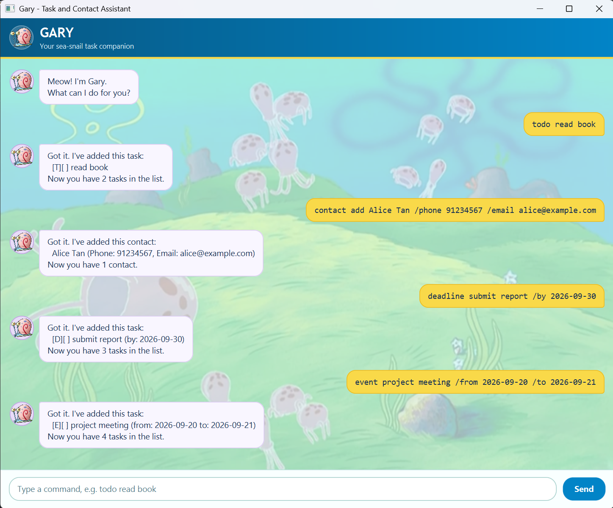

# Gary

Gary is a Java 25 desktop chatbot for managing tasks and contacts. Its JavaFX
interface supports todos, deadlines, events, task search, completion tracking,
contact management, and automatic local persistence.



## Run Gary

Download `gary.jar` from the [latest release](https://github.com/Azora04/ip/releases/latest),
place it in an empty folder, and run:

```shell
java -jar "gary.jar"
```

Gary stores data in a `data` folder beside the JAR. See the
[User Guide](https://azora04.github.io/ip/) for every command and its format.

## Build and test

Confirm that Java 25 is active, then use the Gradle wrapper:

```shell
java -version
./gradlew clean check shadowJar
```

On Windows, replace `./gradlew` with `gradlew.bat`. The executable fat JAR is
created at `build/libs/gary.jar` and includes Gary's JavaFX dependencies for
Windows, macOS, and Linux.
